<div align="center">

# DiabetesSense

**A diabetes risk screen built from nineteen questions you can answer from memory,
with no blood draw and no lab.**

[](https://www.python.org/)
[](https://react.dev/)
[](https://scikit-learn.org/)
[](https://flask.palletsprojects.com/)
[](LICENSE)

</div>

Random Forest over CDC BRFSS 2015 — 253,680 survey responses, eleven classifier
families benchmarked head to head, three class-balancing strategies compared —
served as a Flask API behind a React front end.

*BSc thesis project. Hammad Ahmad and Inshra Javed, with Dr Maleeha Azem and
Dr M. Umar Khan. Department of Biosciences and Department of Electrical and
Computer Engineering, COMSATS University Islamabad, 2024.*

<div align="center">
  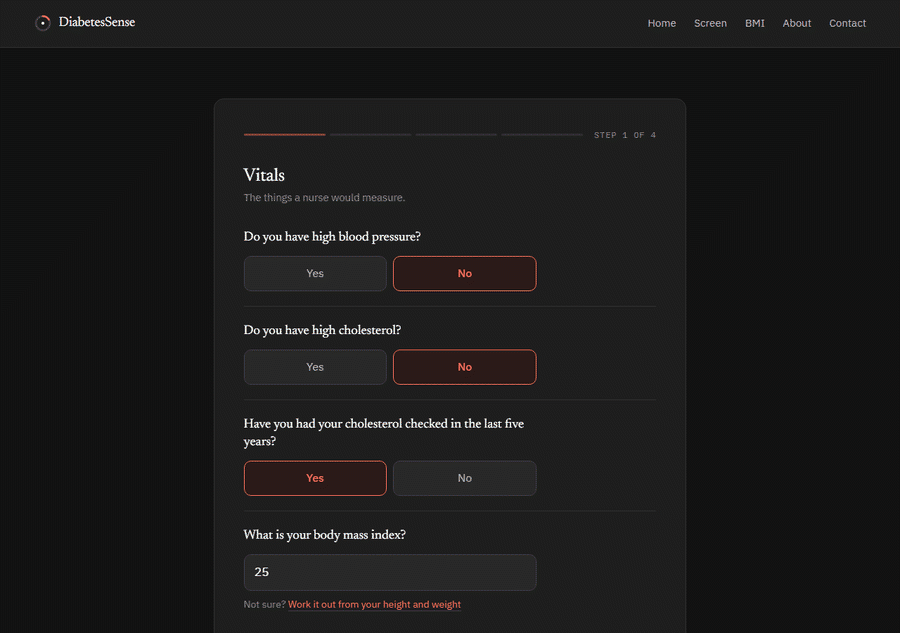
</div>

A 60-64 year old man with high blood pressure, high cholesterol, a BMI of 34.2,
no regular physical activity and self-rated *fair* general health comes back as a
positive screen. The API puts the probability at **70.0%**; the results view names
the five answers that drove it and attaches a recommendation to each.

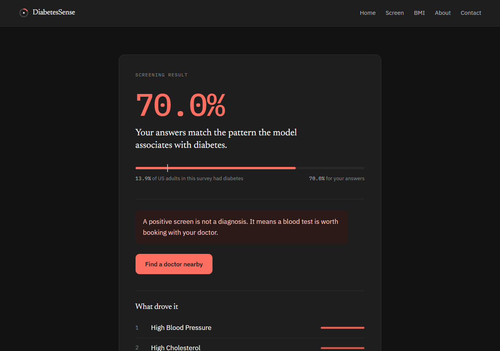

---

## Why this is different

Most diabetes-risk demos are one classifier on one split. Three things here are not.

**1 · No lab work anywhere in the loop.**
No HbA1c, no fasting glucose, no blood draw. Nineteen self-reportable answers —
blood pressure, cholesterol, BMI, activity, general health, age band — which is the
whole point: a screen that costs nothing to take is a screen people actually take.

**2 · Eleven classifiers, benchmarked, not assumed.**
Logistic regression through to CatBoost, each trained and scored on the same split
rather than picking a favourite and reporting it. The leaderboard below is the
result, and it is not close.

**3 · The class imbalance *is* the problem.**
The raw cohort is 86.1% / 13.9%. A model that answers "no diabetes" every single
time scores 86.1% accuracy and is completely useless. Every decision downstream —
the sampler, the metrics reported, which model ships — exists to avoid that trap.

---

## How it works

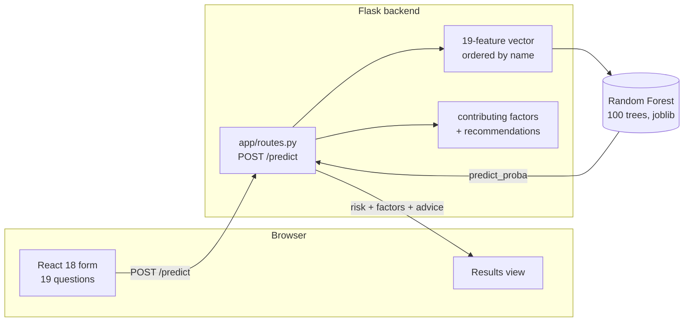

A questionnaire in, a probability and a plain-language explanation out. The model
scores the risk; a separate rule layer reads the same answers to say *which* of them
mattered, so the output is never a bare number.

<details>
<summary><b>Request lifecycle in detail</b></summary>

```
1. POST {19 indicators}                     React form → app/routes.py
2. Presence check against FEATURE_ORDER     missing keys → 400, named
3. Build the vector by name, not dict order a reordered payload must score identically
4. predict_proba(v)[0][1]                   → risk probability
5. get_contributing_factors(data)           threshold rules over the raw answers
6. get_recommendations(factors)             one line per factor
7. Respond {prediction, risk_probability,
            contributing_factors, recommendations}
```

The vector is assembled by name rather than by iterating the request dictionary,
so a client that sends the same nineteen answers in a different order gets the same
prediction instead of a silently scrambled one.

</details>

<details>
<summary><b>The nineteen questions</b></summary>

BRFSS ships 21 indicators. `Fruits` and `Veggies`, two coarse yes/no proxies for
diet, are dropped in the notebook before training, leaving nineteen. Both sit among
the weakest signals in the set — −0.04 and −0.06 against the outcome on the full
cohort — and dropping them takes two questions off the form:

| Question | Coding |
|---|---|
| High blood pressure | 0 / 1 |
| High cholesterol | 0 / 1 |
| Cholesterol checked in 5 years | 0 / 1 |
| BMI | kg/m², 10-50 |
| Smoked 100+ cigarettes | 0 / 1 |
| Ever had a stroke | 0 / 1 |
| Heart disease or attack | 0 / 1 |
| Regular physical activity | 0 / 1 |
| Heavy alcohol consumption | 0 / 1 |
| Any healthcare coverage | 0 / 1 |
| Skipped a doctor over cost | 0 / 1 |
| General health | 1 excellent … 5 poor |
| Poor mental-health days | 0-30 |
| Poor physical-health days | 0-30 |
| Difficulty walking or stairs | 0 / 1 |
| Sex | 0 female / 1 male |
| Age | 13 five-year bands, 18-24 … 80+ |
| Education | 1-6 |
| Income | 1-8 |

Age is a **band index**, not a year count — the model never sees "63".

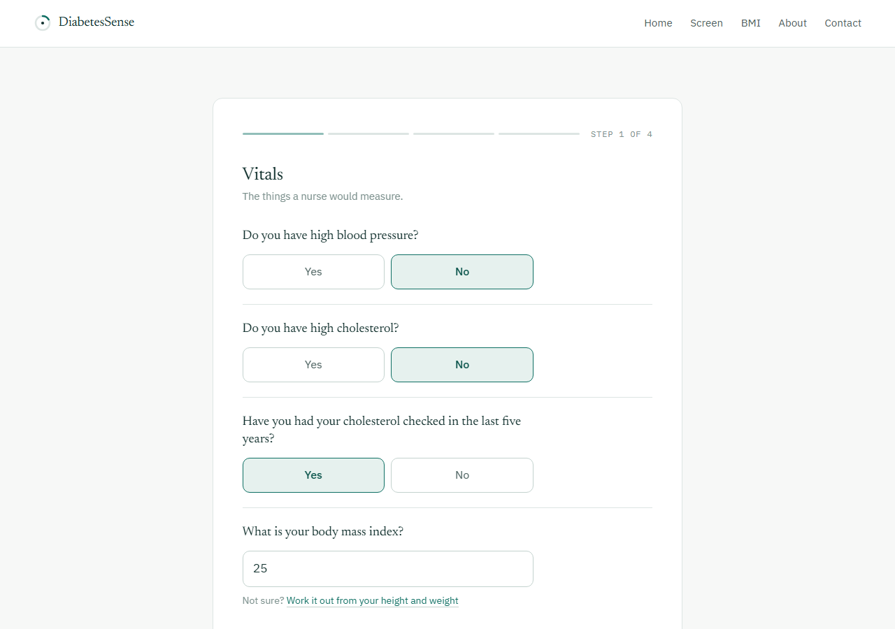

</details>

<details>
<summary><b>Why random over-sampling</b></summary>

At 86.1 / 13.9, accuracy is a broken metric out of the box, so the training set is
rebalanced to 50/50 first. Three ways to do that were run head to head:

- **ROS** duplicates existing minority rows. Nothing invented.
- **SMOTE** interpolates new synthetic rows between minority neighbours.
- **ADASYN** does the same, weighted toward the rows that are hardest to classify.

Most of the indicators here are binary or small-integer ordinals — "high blood
pressure" is 0 or 1, general health is 1 to 5. Interpolating between two such rows
produces values that no respondent could ever have given. ROS duplicates real
answer sheets instead, and it is the sampler under which the tree models pull
furthest ahead. See [the head-to-head below](#three-ways-to-balance-the-classes).

</details>

---

## Results

### The model leaderboard

<picture>
  <source media="(prefers-color-scheme: dark)" srcset="docs/assets/leaderboard_dark.svg">
  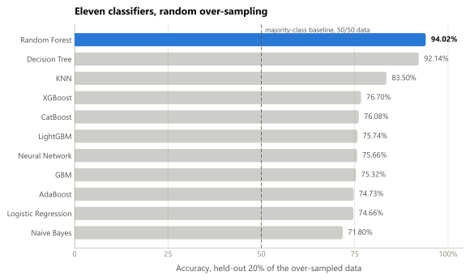
</picture>

**Random Forest wins, and the gap is not subtle.** It clears the next-best model by
almost two points and the boosted ensembles by seventeen. That ordering is the
interesting part: XGBoost, CatBoost and LightGBM — normally the default answer for
tabular data — sit in a flat cluster in the mid-seventies, while the two models that
memorise the answer space outright take the top two places.

> The charts on this page are regenerated from `rf_replication/results_*.json` by
> [`tools/make_readme_charts.py`](tools/make_readme_charts.py), which is a re-run
> of the benchmark rather than the original thesis run. It lands at **94.02%** against
> the **93.15%** reported in the write-up; the figures move with the seed and the tree
> count, and the ordering is unchanged.

### Catching cases against avoiding false alarms

<picture>
  <source media="(prefers-color-scheme: dark)" srcset="docs/assets/sens_spec_dark.svg">
  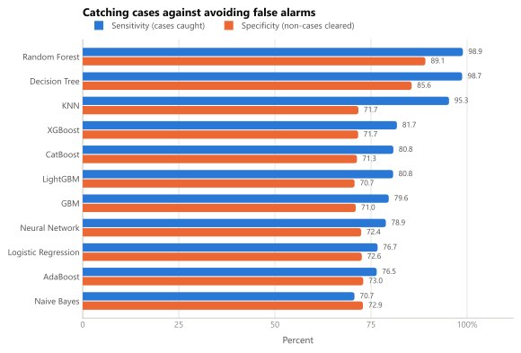
</picture>

For a screening tool the left bar is the one that matters. Missing a case sends
someone home reassured; a false alarm sends them for a test they did not strictly
need. Random Forest catches **98.90%** of cases while still clearing **89.14%** of
non-cases — the only model that is strong on both. Naive Bayes is the honest
counter-example: it is the *only* model whose specificity beats its sensitivity,
which is exactly the wrong way round for a screen.

### ROC across all eleven

<picture>
  <source media="(prefers-color-scheme: dark)" srcset="docs/assets/roc_dark.svg">
  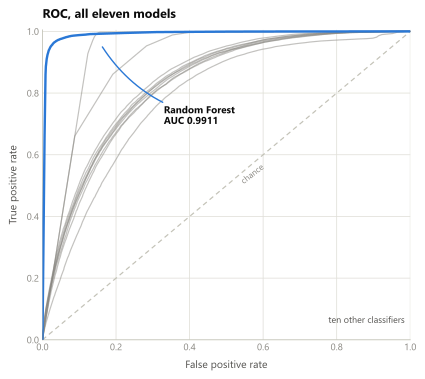
</picture>

Ranking quality, independent of where the decision threshold happens to sit.
Random Forest reaches **AUC 0.9911** and the curve hugs the top-left corner; the
remaining ten trail well below it.

### Three ways to balance the classes

<picture>
  <source media="(prefers-color-scheme: dark)" srcset="docs/assets/balancing_dark.svg">
  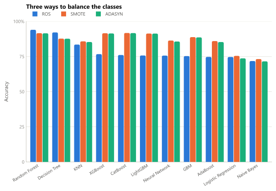
</picture>

The sampler changes the answer, and it does not change it uniformly. Under SMOTE
and ADASYN the field compresses into a tight band around 91.5% and the boosted
ensembles catch up almost exactly to Random Forest. Under ROS the tree models pull
away and the ensembles fall back to the mid-seventies. Same data, same models,
different rebalancing — which is why the comparison is in the repo rather than a
footnote.

### Where the errors land

<picture>
  <source media="(prefers-color-scheme: dark)" srcset="docs/assets/confusion_dark.svg">
  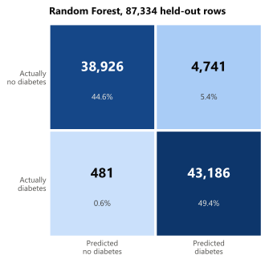
</picture>

481 missed cases against 4,741 false alarms, on the balanced held-out split. The
errors are lopsided by design: for a screen, the cheap mistake is telling someone to
get tested when they did not need to.

### What the data says

<picture>
  <source media="(prefers-color-scheme: dark)" srcset="docs/assets/correlations_dark.svg">
  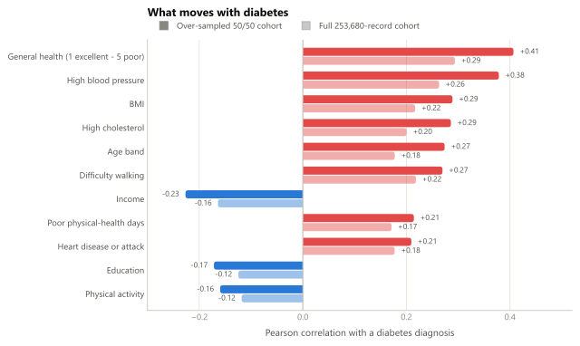
</picture>

General health is the strongest single signal, ahead of blood pressure, BMI and
cholesterol. Income and education both run negative — a socioeconomic gradient sits
underneath the clinical one. Both cohorts are plotted because rebalancing lifts every
coefficient by roughly a tenth: the ordering is stable, the magnitudes are not, and a
correlation quoted without its cohort is ambiguous.

<picture>
  <source media="(prefers-color-scheme: dark)" srcset="docs/assets/age_prevalence_dark.svg">
  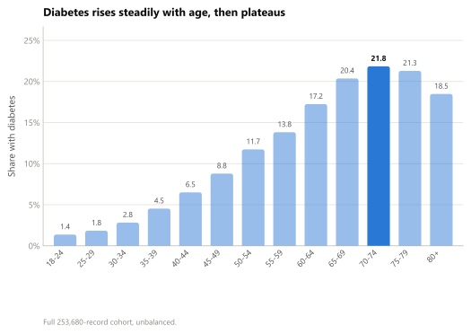
</picture>

Prevalence climbs from **1.4%** in the 18-24 band to **21.8%** at 70-74, then falls
back slightly in the oldest two — a survivorship effect, not a protective one.

<details>
<summary><b>Underlying numbers</b></summary>

Thesis protocol: rebalance the full dataset to 50/50, then split 80/20.
Source: `rf_replication/results_{ROS,SMOTE,ADASYN}.json`.

**Random over-sampling**

| Model | Accuracy | Sensitivity | Specificity |
|---|---|---|---|
| **Random Forest** | **94.02%** | **98.90%** | **89.14%** |
| Decision Tree | 92.14% | 98.72% | 85.57% |
| KNN | 83.50% | 95.29% | 71.72% |
| XGBoost | 76.70% | 81.74% | 71.66% |
| CatBoost | 76.08% | 80.82% | 71.35% |
| LightGBM | 75.74% | 80.76% | 70.72% |
| Neural Network | 75.66% | 78.86% | 72.45% |
| GBM | 75.32% | 79.61% | 71.04% |
| AdaBoost | 74.73% | 76.48% | 72.98% |
| Logistic Regression | 74.66% | 76.72% | 72.60% |
| Naive Bayes | 71.80% | 70.70% | 72.90% |

**SMOTE**

| Model | Accuracy | Sensitivity | Specificity |
|---|---|---|---|
| CatBoost | 91.76% | 86.19% | 97.33% |
| Random Forest | 91.61% | 88.10% | 95.11% |
| XGBoost | 91.56% | 86.01% | 97.11% |
| LightGBM | 91.35% | 86.31% | 96.40% |
| GBM | 88.80% | 87.26% | 90.35% |
| Decision Tree | 87.73% | 88.18% | 87.29% |
| Neural Network | 86.37% | 83.34% | 89.41% |
| AdaBoost | 85.99% | 85.38% | 86.61% |
| KNN | 85.79% | 89.60% | 81.97% |
| Logistic Regression | 75.46% | 78.06% | 72.86% |
| Naive Bayes | 73.19% | 79.35% | 67.02% |

**ADASYN**

| Model | Accuracy | Sensitivity | Specificity |
|---|---|---|---|
| CatBoost | 91.67% | 85.69% | 97.49% |
| Random Forest | 91.52% | 87.70% | 95.24% |
| XGBoost | 91.42% | 85.36% | 97.30% |
| LightGBM | 91.33% | 85.65% | 96.85% |
| GBM | 88.62% | 86.47% | 90.72% |
| Decision Tree | 87.66% | 88.06% | 87.28% |
| Neural Network | 85.68% | 80.74% | 90.48% |
| KNN | 85.32% | 89.53% | 81.23% |
| AdaBoost | 85.30% | 84.95% | 85.64% |
| Logistic Regression | 73.70% | 76.05% | 71.42% |
| Naive Bayes | 71.57% | 79.28% | 64.07% |

Regenerate everything with `python tools/make_readme_charts.py`.

</details>

---

## Tech stack

| Layer | Tech | Where it lives |
|---|---|---|
| Model | `RandomForestClassifier`, 100 trees | `diabetes_dataset/diabetes-prediction-tool.ipynb` |
| Balancing | `imblearn.RandomOverSampler` | same notebook |
| Benchmark | 11 classifiers × 3 samplers | `rf_replication/thesis_replication.py` |
| API | Flask 3, flask-cors, joblib | `app/routes.py` |
| Front end | React 18, react-router 6, axios | `diabetes-predictor/src/` |
| Charts | matplotlib, light/dark SVG pairs | `tools/make_readme_charts.py` |
| Container | node:18 build → python:3.9 runtime | `Dockerfile`, `docker-compose.yml` |

---

## Quickstart

Requires Python 3.11 and Node 18+.

```bash
git clone https://github.com/1oNN/diabetes-app.git
cd diabetes-app

# 1. Backend
pip install -r requirements.txt

# 2. Train the model  (produces the joblib artifact - see the note below)
jupyter notebook diabetes_dataset/diabetes-prediction-tool.ipynb

# 3. Serve
python run.py                       # http://localhost:5000

# 4. Front end
cd diabetes-predictor
echo "REACT_APP_BACKEND_URL=http://localhost:5000" > .env
npm install && npm start            # http://localhost:3000
```

> **The trained model is not in the repository.** The forest runs to unbounded
> depth over 436,668 over-sampled rows, which puts the `.joblib` artifact at
> roughly 738 MB — past what belongs in git. Step 2 above regenerates it into
> `app/model/`. The dataset itself *is* committed, so the notebook runs from a
> clean clone.

To regenerate the charts on this page, install the extra tooling with
`pip install -r requirements-dev.txt` and run `python tools/make_readme_charts.py`.

---

## Limitations

- BRFSS is a **telephone survey**: every indicator is self-reported, including
  height and weight. Self-reported BMI skews low.
- The 2015 cohort is **US-only**. Prevalence, the income gradient and the education
  gradient are all population-specific and will not transfer unchanged.
- The tool **screens, it does not diagnose**. A positive result is a reason to get a
  blood test, and nothing more.
- The reported figures are measured on the **rebalanced** data, where the
  majority-class baseline is 50% rather than 86.1%.
- No user input is stored or logged.

---

## Documentation

**Design** · [How it works](HOW_IT_WORKS.md) · [Deployment](DEPLOYMENT.md) · [Run guide](HOW_TO_RUN.md)

**Evaluation** · [Benchmark replication](rf_replication/README.md) · [Per-model results](rf_replication/MODEL_RESULTS.md) · [Correlation checks](rf_replication/RESULTS.md)

**Full case study** · [hammadahmad.co.uk/projects/diabetes-risk](https://hammadahmad.co.uk/projects/diabetes-risk)

---

## Acknowledgements

COMSATS University Islamabad, Department of Biosciences and Department of Electrical
and Computer Engineering. Dataset: the CDC's
[Behavioral Risk Factor Surveillance System](https://www.cdc.gov/brfss/index.html), 2015.

## License

Distributed under the MIT License. See [LICENSE](LICENSE) for details.
